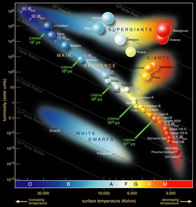

## The Evolution of Our Universe
Hello! My name is Matthew Bzowyckyj and I am a freshman at Kingswood OXford School in West Hartford, CT. During the summer of 2018, I worked as a researcher at UCONN to follow my passion in astronomy and astrophysics. This website compiles all that I have learned during the past three months. 

## The Evolution of Stars

  Stars come in many shapes and sizes. Usually, a star begins as small and blue.The more massive a star is, the more energy it contains and the higher temperature it has. As the star becomes older, it begins to grow in size and turn more yellow. The star is no longer as massive, and it begins to cool. The older the star becomes, the redder and cooler it becomes. It will also increase in diameter. Eventually, the star will start to run out of energy. When the star beings to create iron, it can no longer sustain itself. The gravity pulling inward towards the star's center becomes greater than the force pushing outward. The gravity will cause the star to collapse, shedding its outer layer. A star usually leaves its small core behind as a red or white dwarf as a planetary nebula.
  If a star is more massive, it may instead turn into a neutron star or black hole. A neutron star is considered the extreme version of a white dwarf. During its supernova, the star pushes everything away except for the neutrons in its core. It leaves a small, dense object with an extremely fast rotation, spinning hundreds of times a second. Neutron stars are usually created from stars that are more massive, but not massive enough to form a black hole.
  If a star is very massive, it will most likely turn into a black hole. When the star explodes, its gravity is so strong that it compresses all of its mass together, creating a black hole. The gravity of a black hole is so strong, nothing can escape its hold, including light. Black holes are invisible to us because all of the light is absorbed, so no light can bounce back to us. We know where black holes are because of its accretion disks. Accretion disks are disk-like objects that form around the black hole. It is comprised of all the matter it pulled in spinning around the black hole. The size and brightness of its accretion disk can help us determine the sixe of a black hole.
  Link: [The First Image of a Black Hole](https://www.google.com/)
  
## The Evolution of Galaxies

 There are two main categories of galaxies in the universe. Some galaxies are more disorganized and spherical. These galaxies are called elliptical galaxies. Others are more organized, star forming disk-like galaxies. These galaxies are usually spiral or barred spiral.
  

  Younger galaxies tend to be smaller and disk-like, as the majority of the stars are in adolescence (small and blue). These galaxies often contain many starforming regions, as the stars experience quick lives. When these stars die, they give off many nutrients and elements for new stars. The constant creation and destruction of young, bluer stars means a well-developed galaxy that is disk-like and organized. Over time,

## Celestial Mergers
  The universe is a chaotic place. T
